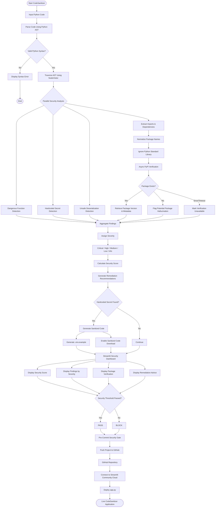

## 🔄 System Flowchart

The following flowchart illustrates the complete CodeSanitizer workflow, from AI-generated Python code input to security analysis, package verification, remediation, sanitization, and deployment.



### 🛡️ Security Analysis Components

| Component                       | Purpose                                                    |
| ------------------------------- | ---------------------------------------------------------- |
| **Python AST**                  | Parses and understands the actual structure of Python code |
| **Secret Detector**             | Identifies hardcoded API keys, passwords and tokens        |
| **Dangerous Function Detector** | Detects `eval()`, `exec()`, unsafe subprocess usage, etc.  |
| **Deserialization Detector**    | Detects dangerous patterns such as `pickle.loads()`        |
| **Import Extractor**            | Extracts dependencies directly from the AST                |
| **Async PyPI Checker**          | Concurrently verifies external packages against PyPI       |
| **Severity Engine**             | Classifies findings as Critical, High, Medium, Low or Info |
| **Remediation Engine**          | Generates practical fixes                                  |
| **Sanitizer**                   | Replaces detected secrets with environment variables       |
| **`.env.example` Generator**    | Creates a safe environment-variable template               |
| **Security Dashboard**          | Displays the complete scan results                         |
| **Pre-Commit Gate**             | Can block commits containing serious vulnerabilities       |

### 🔐 Overall Security Pipeline

```text
AI-Generated Code
       ↓
Python AST Parsing
       ↓
Structural Analysis
       ↓
┌───────────────┬────────────────┬─────────────────┐
│               │                │                 │
▼               ▼                ▼                 ▼
Secrets      Dangerous       Deserialization   Imports
Detection    Functions        Detection        Extraction
│               │                │                 │
└───────────────┴────────────────┴─────────────────┘
                         ↓
                Async PyPI Verification
                         ↓
              Package Hallucination Check
                         ↓
                 Finding Aggregation
                         ↓
                 Severity Classification
                         ↓
                  Security Score
                         ↓
                 Remediation Advice
                         ↓
             ┌───────────┴───────────┐
             │                       │
             ▼                       ▼
       Secret Found?              No Secret
             │                       │
             ▼                       │
      Sanitized Code                │
             │                       │
      .env.example                  │
             │                       │
             └───────────┬───────────┘
                         ↓
                 Streamlit Dashboard
                         ↓
                  Security Threshold
                    ↙            ↘
                 PASS            BLOCK
                    ↓              ↓
                    └──────┬───────┘
                           ↓
                    Pre-Commit Gate
                           ↓
                       GitHub
                           ↓
                Streamlit Cloud
                           ↓
                    Live Application
```

## 🚀 Deployment

CodeSanitizer can be developed locally in VS Code, pushed to GitHub, and deployed through Streamlit Community Cloud.

```text
VS Code
   ↓
Local Testing
   ↓
Git Commit
   ↓
Git Push
   ↓
GitHub Repository
   ↓
Streamlit Community Cloud
   ↓
Live CodeSanitizer
```

# 🛡️ CodeSanitizer

AI-Generated Code & Package Hallucination Auditor.

CodeSanitizer detects security problems commonly introduced by AI-generated Python code.

## Features

- AST-based Python security analysis
- Hardcoded secret detection
- Dangerous function detection
- Unsafe deserialization detection
- Command injection detection
- PyPI package verification
- Async dependency checking
- Security score
- Remediation recommendations
- .env.example generation
- Sanitized code download
- Streamlit dashboard
- CLI/pre-commit ready architecture

## Run locally

Create a virtual environment:

python -m venv .venv

Activate it on Windows:

.venv\Scripts\activate

Install dependencies:

pip install -r requirements.txt

Run:

streamlit run app.py

## Security Architecture

CodeSanitizer parses Python source code using Python's AST module.

Imports are extracted from the syntax tree and verified against PyPI.

Security findings are assigned severity levels and remediation guidance.


